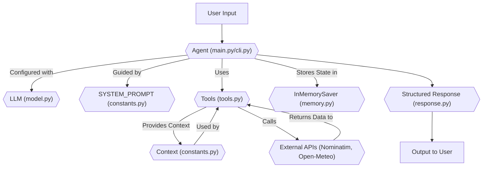

# ai-weather-forecasting-agent

An AI agent for weather forecasting, capable of providing punny weather responses for specific locations.

Getting started
---------------

1. Create and activate a virtual environment:

```powershell
python -m venv .venv
.\.venv\Scripts\Activate.ps1
```

2. Install dependencies:

```powershell
pip install -r requirements.txt
pip install langchain-openai
```

3. Run the CLI for a single forecast:

```powershell
python -m ai_weather_forecasting_agent "San Francisco"
```
Or for interactive conversation:

```powershell
python -m ai_weather_forecasting_agent.main
```
In interactive mode, type your weather queries after "You: " and type `exit` or `quit` to end the conversation.

4. Run tests:

```powershell
python -m unittest discover -v
```

Project Structure
-----------------

This project is structured to define and run an AI weather forecasting agent.

-   `pyproject.toml`: Project metadata and script entry point definitions.
-   `requirements.txt`: Lists the runtime dependencies for the project.
-   `src/ai_weather_forecasting_agent/`: Contains the core source code for the AI agent.
    -   `__init__.py`: Initializes the Python package.
    -   `__main__.py`: Allows the package to be run as a script (`python -m ai_weather_forecasting_agent`). It calls the `cli.main` function.
    -   `cli.py`: Defines the command-line interface for the weather agent, handling location arguments and single-turn forecasts.
    -   `constants.py`: Stores constant values and shared dataclasses, such as the `SYSTEM_PROMPT` for the AI and the `Context` schema.
    -   `main.py`: The entry point for the interactive chat mode, setting up the agent and managing the conversation loop.
    -   `memory.py`: Configures the `InMemorySaver` for the agent, providing temporary conversational memory.
    -   `model.py`: Initializes and configures the large language model (LLM) used by the agent.
    -   `response.py`: Defines the `ResponseFormat` dataclass, which dictates the structured output format of the agent's responses.
    -   `tools.py`: Contains the definitions of the external tools (`get_weather_for_location`, `get_user_location`) that the AI agent can utilize.
-   `tests/`: Contains unit tests for the project components.

Memory Management
-----------------
The agent utilizes an `InMemorySaver` (configured in `memory.py`) for managing conversational memory. This allows the agent to maintain context across multiple turns within a single interactive session. However, as it's an in-memory solution, the conversation history is not persistent and will be cleared when the application is restarted.

Architecture
------------

The AI Weather Forecasting Agent is built around a modular architecture, leveraging the `langchain` and `langgraph` libraries to orchestrate interactions between a Large Language Model (LLM) and specialized tools.

At its core, the system flow is as follows:

1.  **User Input**: The user initiates a request either via a direct CLI command or an interactive chat interface.
2.  **Agent Invocation**: The input is fed to the `Agent` (defined in `main.py` and `cli.py`), which is configured with an LLM, a system prompt, and a set of tools.
3.  **LLM Reasoning**: The LLM (`model.py`) processes the user's input and the `SYSTEM_PROMPT` (`constants.py`) to determine the appropriate action. It decides whether to use a tool or directly generate a response.
4.  **Tool Execution**: If a tool is required (e.g., to get weather data or user location), the agent calls the relevant function from `tools.py`.
    *   `get_user_location`: Retrieves mock user location based on a `user_id` from the `Context`.
    *   `get_weather_for_location`: Uses external APIs (Nominatim for geocoding, Open-Meteo for weather) to fetch real-time weather information.
5.  **Context and Memory**: The `Context` dataclass (`constants.py`) provides user-specific information to the tools. The `InMemorySaver` (`memory.py`) allows the agent to maintain conversation history across turns.
6.  **Structured Response**: The agent formulates its final response according to the `ResponseFormat` (`response.py`), which includes a punny message and optional weather conditions.
7.  **Output**: The structured response is then presented to the user.


